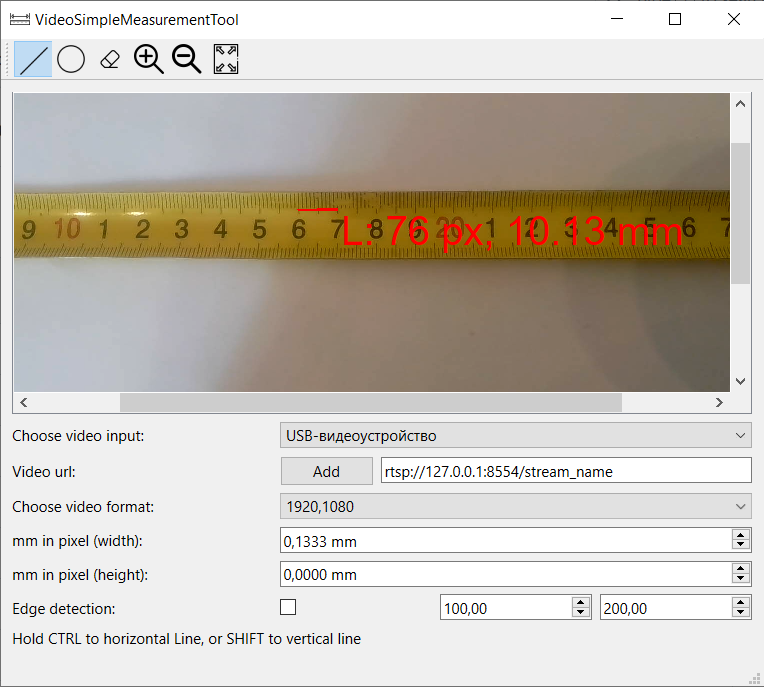

# QVideoSimpleMeasurementTool

## Description



Simple GUI app for linear and circular measurements using image form video.

- Videosources: OS devives (usb and etc.), RTCP videostream.
- Tools: Linear measurements, Circular measurements, Zooming, EdgeDetector filter.

## Installation

### Dependencies
- OpenCV
- GTest
- Qt 6.8.3

### Build

```
mkdir build && cd build
cmake ..
make
```
